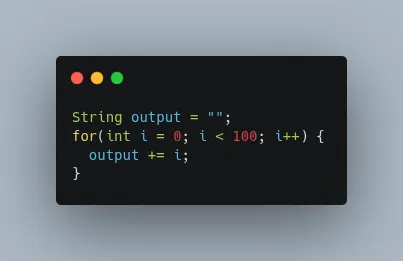

# Important Aspects of Java Strings and the String Pool Every Developer Should Know


<p style="text-align:center">Photo by Bernd 📷 Dittrich on Unsplash</p>

String is one of the most widely used classes in Java. It's used with user input, logging, communication and so on. As a way to optimization, Java introduced two key concepts in relation to String: immutability and String pool.

## How is a String Object created?
There are two ways we can create a String object:

- **Using double quotes (String literal)**:

  `String test = "Test";`

- **Using the new keyword (calling String constructor)**:

  `String test = new String("Test");`

What’s the difference?

Let’s compare:


The difference lies in the way Java handles String object creation:

When a String literal is created (double quotes), the JVM searches in a special space in the heap memory - _String pool_. 
If a String with the same value already exists, a reference to its address is returned without allocating additional memory, otherwise a new String is created in the pool then its reference is returned.

Whereas using `new` keyword enforces the creation of a new String regardless whether it exists in the pool or not.

So the first line of code is `true` because both literals will point to the same object in the pool, while `test1` and `test2` are pointing to two distinct objects, so it’s `false`.

**_But what exactly is the purpose of String pool?_**

String pool is essentially a pool of Strings in the heap where Strings with equal value get stored. 
It’s a way to optimize memory use, because String is immutable in Java, so any attempt to modify its value (e.g. concatenation) results in creating a new String, which leads to increased memory usage.



This code snippet attempts to concatenate a String 100 times. What will happen is that a hundred Strings will be created and stored in the heap because of String’s immutability. 
So a hundred objects obviously put a heavy load on the memory.

String pool helps reduce unnecessary memory consumption by reusing references for objects of the same values.

As a best practice, we should use String literals (double quotes) rather than `new String()`.
It’s cleaner and much more readable and allows the JVM to optimize the code.

## Comparison using `==` vs. `equals()`

- The `==` operator compares references of objects to check if both point to the same object in memory.
- `equals()` compares the values — whether the content of the two Strings is the same:

]

**How many Strings are created with the following statement?**

```java
    String city = new String("Istanbul");
```

If the String does not already exist in the pool, the code above creates two objects:

- `Istanbul` gets added in the pool and a pooled String object is created (first object).
- The `new` keyword calls the String constructor and creates a new String object in the heap (second object).

If Istanbul **_does_** exist in the pool, only one String object is created in the heap.

So in summary, the String pool is an effective feature in Java to reduce memory overhead that String the immutable nature produces by reusing String references to objects of identical values.

Thanks for reading!
